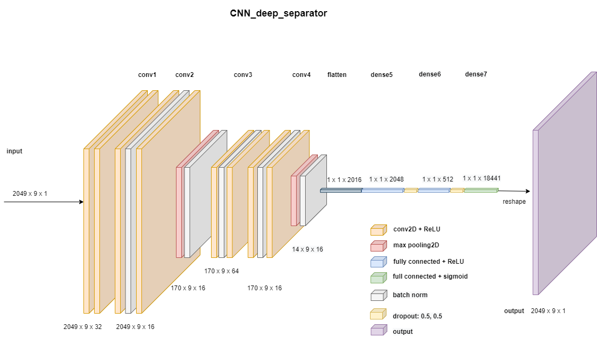
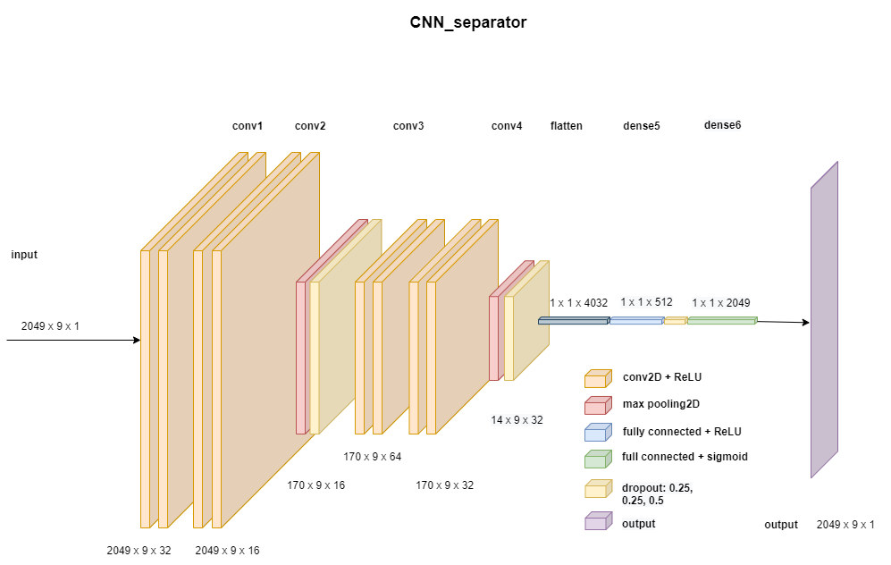

# Abstract

The Digital Audio Signal Processing is not a recent innovation, however, due to
the fast development of the Music Information Retrieval (MIR) and the proliferation
of information on the World Wide Web, its applications have grabbed the attention
of researchers. The future of this domain seems quite auspicious and researchers
throughout the world contribute their expertise by designing novel architectures,
examining innovative approaches and optimizing the challenging process of training
Deep Neural Networks with a bulk of information. 

In this dissertation we present the
process of developing and designing Convolutional Neural Networks CNN utilizing
the Ideal Binary Mask IBM aiming to achieve the Separation and Isolation of Vocals
in Musical Pieces -a problem that is traced to the category of Music Source Separation (MSS). For the training process of the proposed architectures we have used
exclusively musical data which include excerpts of spectrograms and the IBMs of
their isolated vocals (feature - label). Given the significance of the data in the development of such a highly accurate network, our contribution to the present research
will not be limited simply to the development of a Singing Voice Separation (SVS)
software, but we also contribute by developing an abstract data pre-processing tool.
Additionally, a Knowledge and a Data-Driven approach of speech and respiratory
audio signals in a noisy environment separation implemented in order to cover an
extensive spectrum of Sound Source Separation (SSS). Last but not least we have
analyzed and assessed the results of the recommended Convolutional Neural Networks among others State-of-the-art architectures, through the developed software
and other Python evaluation BBS libraries. The code of the various audio signal
tools is developed in Python programming language and Keras framework.

## Singing Voice Separation

Single channel singing voice extraction from a music track using a deep learning approach. 
Including a deep convolutional neural network trained with data extracted from MUSDB18 database using a custom 
pre-processing tool. We also used as a baseline other state-of-the-art pre-trained Deep Neural Networks 
methods of separation to test our model score in an SDR (Source to Distortion ratio) metric.

## Voice/Respiratory Denoising

De-noise and Extract vocal information from a single channel audio signal using both a knowledge driven, and 
a data driven approach. For the first approach we used median Filtering and a Nearest Neighbour algorithm by utilizing 
the REPET-SIM method, and for the later we used a LSTM architecture by utilizing the OPEN-UNMIX pre-trained 
models.

[comment]: <> (The tool takes as input a music track loaded from the user or selects a track from the list of the test subset )

[comment]: <> (provided by musdb18. User then selects duration of the separation track for one or more methods. The output is a )

[comment]: <> (folder saved in a path of user's preference that contains the separated vocal track, )

[comment]: <> (an image comparing the mixture, the acapella and the computed mask of the model, a plot-box with the scores of each )

[comment]: <> (method selected scaling signal-to-noise-ratio, scores provided by museval library.)

# Approach
Our proposed architecture consists of 4 convolutional layers, 3 full-connected dense layers, batch normalization 
and dropout layers.
A less deep architecture also is designed in an attempt to simplify the training process and time.
We are going to reference them as _CNN_deep_separator_ and _CNN_separator_.

For the _CNN_deep_separator_
in order to improve our model's accuracy we firstly initiate the weights with 
the _Xavier initializer_, and then train the network as an auto-encoder for 50 epochs using only 
vocal spectrogram excerpts as input - output training data. After the initialization of our model's weights 
we load them into the base model architecture and train for 200 epochs with model checkpoint, which saves the best 
model monitoring validation loss, and early stopping.
The feature - label values of our 
training data is excerpts of Spectrogram Mixture and Ideal Vocal Masks. The **Ideal Vocal Masks** (IBM) firstly introduced 
by [12] are binary masks when multiplied with the mixture spectrogram of a song results in the desired vocal 
spectrogram.
The task of classifying each time-frequency (T-F) bin of a spectrogram into a vocal or nonvocal component can 
be considered as a 
pixel-wise classification problem. Also, by doing so we avoid the pre-process step of labeling our input by 
just computing its IBM.

For the _CNN_separator_ we skipped the training as an auto-encoder process, we subtracted the Batch Normalization 
layer, and we attenuated the output's shape only to the center frame of the predicted IBM.
By doing so, we reduced significantly the trainable parameters and that gave us the space to double the kernel size
of the last convolutional layer.
The networks trained with **47,850** and **43,500** data respectively and got a pretty similar percentage on the 
validation loss function.
We used Binary Cross Entropy as our training objective and after training, our networks reached **0.4285** 
and **0.4397** validation loss respectively.
The proposed reference [12] achieved validation loss **0.3625** using data from _DSD100_ and **0.4509**  
from _iKala_ datasets, but they were trained with **112,081** and **49,096** training instances respectively.

For the postprocess, we create consecutive input chunks of the model's input shape (2049, 9, 1) using an overlapping
window of 8 time frames.
After each prediction we crop the center frame and concatenate to reconstruct the original image.
This process also applied on the ground truth audio signals to compare SDR scores with the predicted,
via the BSS musval Toolbox [19]. A downside to that was the added time of each prediction, 
and thus the overall execution time.
Also, we opted out of the wiener filtering technique as it didn't improve separation quality, 
but we used median-filtering [1] to by-pass any percussive sounds our algorithm didn't.

Our model's SDR score median value is **3.635** in Singing Voice Separation and **9.287** in accompaniment separation 
which is pretty close to **4.73** dB the SDR score achieved in the SVS by 
the referenced CNN trained with similar data from _DSD100_ [12], but with almost 3 times more data than ours.
This kind of comparison is not exclusive as the two architectures used different testing data, so we compared
our results with some participant from SiSEC18.
We out-performed 6 knowledge-driven and 4 supervised learning methods, which used different types of 
deep neural networks HPLP, HPSS, REP1, REP2, RPCA, MELO and RGT2, STL2, HEL1, WK [1, 2, 3, 14, 13, 15, 16, 17].
Comparisons were done by evaluating the median SDR value for each of the 50 tracks in the MUSDB18 test set.
The above methods took part in the SiSEC18 campaign [18], and we were able to compare with them using the museval 
library. 

# Architecture

# Usage:

# Create training data

`usage: preprocess_data_tool.py [-h] [-f] [-H] [-w] [-sr] [-iw] [-sp] [-q | -v]
                               data_directory iterations mode`

Preprocessing data tool. Creates training data from MUSDB18 database.

positional arguments:
>  dataset_directory &nbsp;&nbsp;&nbsp;&nbsp;  set name of directory to save custom database  
>  iterations   &nbsp;&nbsp;&nbsp;&nbsp;&nbsp;&nbsp;&nbsp;&nbsp;&nbsp;&nbsp;&nbsp;&nbsp;&nbsp;&nbsp;&nbsp;&nbsp;&nbsp; set number of chunks for each song  
> mode &nbsp;&nbsp;&nbsp;&nbsp; &nbsp; &nbsp; &nbsp; &nbsp; &nbsp; &nbsp; &nbsp; &nbsp; &nbsp; set mode, available options `SVS`, `VAD`. `DAE`. Each
                        option corresponds to different kind of training data
                        created

optional arguments:
>  -h, --help      &nbsp;&nbsp;&nbsp;&nbsp;&nbsp;&nbsp;&nbsp;&nbsp;&nbsp;&nbsp;&nbsp;&nbsp;&nbsp;&nbsp;&nbsp;&nbsp;      show this help message and exit  
>  -f , --frame_size  &nbsp;&nbsp;&nbsp;&nbsp;&nbsp;   set frame size  
>  -H , --hop_length  &nbsp;&nbsp;&nbsp;   set hop length  
>  -w , --win_length &nbsp;&nbsp;&nbsp;&nbsp;  set sample rate  
>  -sr , --sample_rate &nbsp;  set sample rate  
>  -iw , --width   &nbsp;&nbsp;&nbsp;&nbsp;&nbsp;&nbsp;&nbsp;&nbsp;&nbsp;&nbsp;&nbsp;&nbsp;      set width for image size  
>  -sp , --start_point &nbsp;&nbsp;&nbsp;  set starting point for spectrogram excerpts, if None default is zero  
>  -ow , --label_width &nbsp;  set width for the output - label matrix width, default value is 9  

## Requirements
Download MUSDB18 dataset [11] and save the data folder named `musdb18` in this repo root directory.

MUSDB18 training dataset contains 100 songs, although we excluded all songs produced by Music Delta, as some of them were problematic having little to no vocals.

## Steps to reproduce our training data
### CNN_separator
`python preprocess_data_tool.py svs_550_out_1 550 SVS -ow 1`  

Data created will be used for the `CNN_separator` model.

Tool creates 550 sets of feature - label pairs using the `musdb` library. Each set contains 87 excerpts of the mixture spectrogram as the feature 
and 87 excerpts of vocals IBM as the corresponding label,
for each song in the training MUSDB18 dataset.
Execution requires 10 hours and 15 minutes, creates 47,850 samples of 100ms each.
Our default pre-process parameters defined in the 
`configuration_files/vocal_separator_tool` folder, create input chunks of shape (2049, 9) and output (2049, 9), 
`label_width` is set to 1, so the label matrices consist of 
the center frame of the relative Ideal Binary Mask, giving us a shape of (2049, 1).
Training data are saved in the specified `svs_550_out_1` folder, the tool creates two additional folders named
`mixture_spectrogram` and `vocals_masks` where the input - output pairs lie.

Input shape for set: `(87, 2049, 9)`

Output shape for each set: `(87, 2049, 1)`

### CNN_deep_separator
`python preprocess_data_tool.py ae_100 100 DAE`  

Data created will be used in training of the `CNN_deep_separator` architecture as an auto-encoder to initiate 
its weights.

Creates 100 sets of input - output vocal spectrograms.
Execution requires 2 hours and 19 minutes, creates 8,700 samples of 100ms each.

`python preprocess_data_tool.py svs_500 500 SVS`  

Data created will be used for the `CNN_deep_separator` model.

Input shape for set: `(87, 2049, 9)`

Output shape for each set: `(87, 2049, 9)`

# Train model
`python train.py [-h] [-e] [-b] name data_directory mode`
 
Trains a model. Available modes are `SVS`, `DAE` and `VAD`. For Singing Voice Separation, Auto Encoder and Vocal 
Activity Detection respectively. 

positional arguments:
>  model_name &nbsp;&nbsp;&nbsp;&nbsp;&nbsp;&nbsp;&nbsp;&nbsp;&nbsp;  set model's name  
>  dataset_directory &nbsp;&nbsp;  set model's name  
>  mode &nbsp;&nbsp;&nbsp;&nbsp;&nbsp;&nbsp;&nbsp;&nbsp;&nbsp;&nbsp;&nbsp;&nbsp;&nbsp;&nbsp;&nbsp;&nbsp;&nbsp;&nbsp;&nbsp;&nbsp;&nbsp;  set model's name  

optional arguments:
>  -h, --help &nbsp;&nbsp;&nbsp;&nbsp;&nbsp;&nbsp;&nbsp;&nbsp;&nbsp;&nbsp;&nbsp;&nbsp;&nbsp;&nbsp;&nbsp;&nbsp;&nbsp;&nbsp;&nbsp;&nbsp;&nbsp;&nbsp;&nbsp;&nbsp;&nbsp;      show this help message and exit  
>  -e , --epochs  &nbsp;&nbsp;&nbsp;&nbsp;&nbsp;&nbsp;&nbsp;&nbsp;&nbsp;&nbsp;&nbsp;&nbsp;&nbsp;&nbsp;&nbsp;&nbsp;&nbsp;&nbsp;&nbsp;   set epochs  
>  -b , --batch_size  &nbsp;&nbsp;&nbsp;&nbsp;&nbsp;&nbsp;&nbsp;&nbsp;&nbsp;&nbsp;&nbsp;&nbsp;&nbsp;   set batch size  

## Requirements

Create training dataset by executing the `pre_process_data_tool`.

## Steps to reproduce our models

### CNN_separator

`python train.py CNN_separator svs_550_out_1 SVS -e 200`

Tool reads saved training data from the folder specified, merges all sets and creates train/valid splits (80/20).
Train for 200 epochs with batch size 128.

[comment]: <> (Total training set: `&#40;31320, 2049, 9&#41;`)

[comment]: <> (Total validation set: `&#40;7830, 2049, 9&#41;`)

Model's Input: `(2049, 9, 1)`

Model's Input: `(1, 2049)`

### CNN_deep_separator

`python train.py initialize_cnn_deep_as_autoencoder ae_100 DAE -e 50`

Train for 50 epochs with batch size 128, save model weights.

`python train.py CNN_deep_separator 500 SVS -e 200`

Loads `initialize_cnn_deep_as_autoencoder` model weights and train with data from `svs_500`

Model's Input: `(2049, 9, 1)`

Model's Input: `(1, 2049, 9)`

[comment]: <> (## Prediction service VAD )

[comment]: <> (Predicts vocal activity in test data of musdb and save results in logger)

[comment]: <> (`prediction_service_vad.py [-h]`)

[comment]: <> (positional arguments:)

[comment]: <> (>name &nbsp;&nbsp;&nbsp;&nbsp;&nbsp; choose the name of the model)

# Prediction service SVS
Prediction Service Tool extracts the acapella component from a music track or extract the vocals/respiratory from a 
single channel audio input. 

`prediction_service.py [-h] -f [-p] [-o]`

positional arguments:
>-f, --mode      set mode, options are `acapella`, `voice`, `respiratory`

optional arguments:

>-h, --help    &nbsp;&nbsp;&nbsp;&nbsp;&nbsp;&nbsp;  show this help message and exit  
>-p, --path    &nbsp;&nbsp;&nbsp;&nbsp;&nbsp;&nbsp; set full path of input audio signal 
>-o , --output  &nbsp;&nbsp;&nbsp;set output folder for the results to be saved  
>-w , --wiener  &nbsp;&nbsp;set wiener flag, whether to use wiener filtering in the
                  post-process. Applied only on My_Model_Separator  

## Requirements

Train and save model by executing the above tools.

## Acapella
`python prediction_service.py -f acapella`

User selects song, duration and separation method from user menu. List of song are loaded from `musdb` test set.
Available separation methods are `spleeter`, `open-unmix`, `REPET-SIM` and `MY_MODEL_SEPARATOR`. 
The results save in a folder of choice if `output` argument is specified else is saved in the repo root directory.
Also, user can load any song in a `.mp3, .wav, .aac` format by specifying its full path in the `path` argument.
A spectrogram image of the mixture, the separated source and its soft-mask is saved together with the separated stems
in a `.wav` format. User also can set `wiener` flag to `True` to apply wiener filtering in the `MY_MODEL_SEPARATOR` 
method. The separated audio signal, and the predicted soft-mask image by each method work as
a perceptual metric for the evaluation of music source separation.
Finally, using the `museval` library we perform also an objective evaluation of MSS using the SDR metric.

## Voice/Respiratory

`python prediction_service.py -f voice -p path_to_input_audio_signal` or

`python prediction_service.py -f respiratory -p path_to_input_audio_signal`

For this mode input path argument is required as it takes as input a speech, or a respiratory audio signal,
which are not included in the `musdb` library.
User selects a method of separation between a knowledge and data-driven, `REPET-SIM` and `open-unmix` respectively.
Both methods have fairly good results isolating the vocal content. `REPET-SIM` is using a NN-neighbour algorithm 
to detect repeating patterns of the source of interest and then applies a soft-mask to the input spectrogram, 
while `open-unmix` performs the separation with a LSTM pre-trained model
trained by Sony Corporation for the purpose of speech enhancement. [20]

# Test Service

`python test_service.py`

Evaluates the separation of our proposed CNN model for each track in `musdb` test set. Adds methods from 
SiSEC18 campaign and save results in a `.csv` file. We evaluate 60 seconds for each song, execution 
time 72 hours run only on GPU GeForce GTX 1050 Ti. Then load to the `.csv` file to [this](https://colab.research.google.com/drive/1MkkjvIovxhltNpgz6NWtVg9n3pvDp2zG?usp=sharing) 
python notebook script to display results in a boxplot.

## Set up:

Create a conda virtual environment with at least python 3.6 interpreter and install required packages

`conda create -n myenv python=3.6 pip`

`conda activate myenv`

When the virtual env is ready: 
 
`pip install -r requirements.txt`

# Tensorboard
### In anaconda prompt
- `cd project_directory`

- `conda activate myenv`

- `tensorboard --logdir=logs/`

Python 3.6.12 :: Anaconda, Inc.

# References: 

[1] Harmonic-percussive source separation
librosa-gallery

https://librosa.org/librosa_gallery/auto_examples/plot_hprss.html

[2] Vocal separation
librosa-gallery

https://librosa.org/librosa_gallery/auto_examples/plot_vocal_separation.html

[3] MUSIC/VOICE SEPARATION USING THE SIMILARITY MATRIX
Zafar RAFII, Bryan PARDO
https://users.cs.northwestern.edu/~zra446/doc/Rafii-Pardo%20-%20Music-Voice%20Separation%20using%20the%20Similarity%20Matrix%20-%20ISMIR%202012.pdf

[4] Vocal Separation Using Nearest Neighbours and Median Filtering
Derry Fitzgerald 
https://arrow.tudublin.ie/cgi/viewcontent.cgi?article=1086&context=argcon

[5] Separation of Instrument Sounds using
Non-negative Matrix Factorization with Spectral
Envelope Constraints
https://arxiv.org/pdf/1801.04081.pdf

[6] librosa: Audio and Music Signal Analysis in Python

https://brianmcfee.net/papers/scipy2015_librosa.pdf

[7] Librosa Examples 

https://github.com/librosa/librosa/tree/main/examples

[8] Google drive API Documentation

https://developers.google.com/drive/api/v3/about-sdk

[9] Audio AI: isolating vocals from stereo music using Convolutional Neural Networks
https://towardsdatascience.com/audio-ai-isolating-vocals-from-stereo-music-using-convolutional-neural-networks-210532383785

[10] Supervised Singing Voice Separation:
Designing a data pipeline for supervised learning
http://www.atiam.ircam.fr/Archives/Stages1718/PRETET_Laure_Memoire_Stage.pdf

[11] SigSep MUSDB github

https://github.com/sigsep/sigsep-mus-db

[12] Singing Voice Separation Using a Deep Convolutional Neural Network Trained by Ideal Binary Mask and Cross Entropy

http://dorienherremans.com/sites/default/files/main.pdf

[13] Discriminatively trained recurrent neural networks for single-channel speech separation

https://ieeexplore.ieee.org/abstract/document/7032183

[14] Audiovisual Singing Voice Separation

https://arxiv.org/abs/2104.09946

[15] Improving single-network single-channel separation of musical audio with convolutional layers

https://link.springer.com/chapter/10.1007/978-3-319-93764-9_29

[16] Melody extraction from polyphonic music signals using pitch contour characteristics

https://ieeexplore.ieee.org/abstract/document/6155601

[17] Wave-U-Net: A Multi-Scale Neural Network for End-to-End Audio Source Separation

https://arxiv.org/abs/1806.03185

[18] The 2018 signal separation evaluation campaign

https://link.springer.com/chapter/10.1007/978-3-319-93764-9_28

[19] BSS museval Toolbox

https://github.com/sigsep/sigsep-mus-eval

[20] open-unmix github

https://github.com/sigsep/open-unmix-pytorch